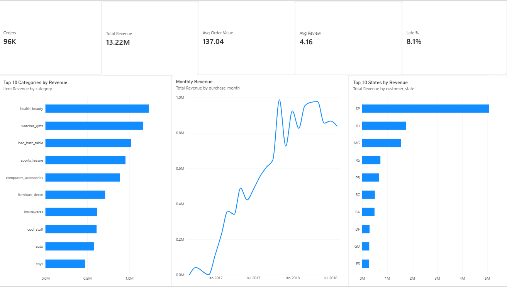
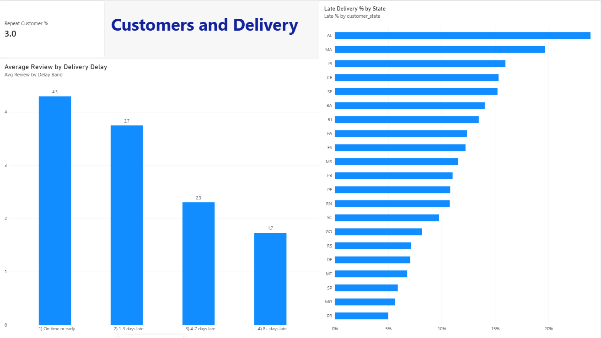

# E-Commerce Marketplace Analysis (Olist): Revenue, Retention and Delivery

By Shiva Lakshmi Padala

## Business problem
Olist is an online marketplace in Brazil. Leadership wants to know: where does revenue come from, why do customers rarely come back, and how much do late deliveries hurt customer satisfaction?

## Dataset
Olist Brazilian E-Commerce Public Dataset: 9 related tables, about 100,000 orders (2016-2018).

## Tools
Python (pandas), SQL (SQLite), Power BI, Google Colab

## Approach
1. Loaded 8 tables and checked data quality (multiple payments, items and reviews per order, and a customer ID that changes with every order)
2. Joined the tables into one analysis table with one row per delivered order (96,470 orders), summarizing each table per order first so nothing is double counted
3. Answered 10 business questions in SQL using joins, CTEs and window functions (LAG, RANK, ROW_NUMBER, SUM OVER)
4. Exported clean files for a Power BI dashboard
5. Wrote findings and recommendations

## Dashboard

## Key findings
1. Scale: 96,470 delivered orders from 93,350 customers generated 13.2M in revenue (Brazilian reais), with an average order value of 137.
2. Revenue is spread across categories: health_beauty (9.3%), watches_gifts (8.8%) and bed_bath_table (7.7%) lead, but the top 3 are only about 26% of revenue.
3. Revenue is concentrated geographically: Sao Paulo (SP) generates 38.3% of revenue, and SP, RJ and MG together about 63%.
4. Retention is the biggest problem: only 3.0% of customers placed a second order, so 97% bought once.
5. Late delivery sharply lowers reviews, and the damage grows with the delay: 4.29 (on time), 3.75 (1-3 days late), 2.30 (4-7 days late), 1.73 (8+ days late).
6. Late orders are 8.1% of orders but account for 33.8% of all bad (1-2 star) reviews, about four times their share, and hold 1.16M (8.8%) of revenue.
7. Customers whose first order was late repeat at 2.51%, versus 3.04% for on-time first orders. Delivery matters, but it does not explain the low retention on its own.
8. Delivery performance varies widely by state: late-delivery rates range from about 5% in PR, MG and SP to over 20% in AL and MA, with most of the worst states in the north-east.

## Recommendations
1. Prioritize severe delays (4+ days late): about 5,000 orders with an average review below 2.0.
2. Build retention with separate levers (post-purchase emails, second-order vouchers) and test them, since even on-time customers rarely return.
3. Reduce dependence on Sao Paulo by testing growth campaigns in RJ and MG, the next two largest markets.
4. Promote high-value categories like watches_gifts and cross-sell in high-volume, lower-value ones like bed_bath_table.
5. Track repeat rate, late-delivery rate and average review monthly as core KPIs.
6. Work with carriers and review delivery estimates in the worst-performing north-eastern states (AL, MA, PI, CE, SE, BA).
 
## Limitations
Data covers 2016-2018 from one marketplace, shows associations (not proof of cause), and repeat purchases are only measured within the dataset window.

## How to run
1. Download the Olist dataset from Kaggle (keep the zip)
2. Open the notebook in Google Colab and upload the zip
3. Run all cells
